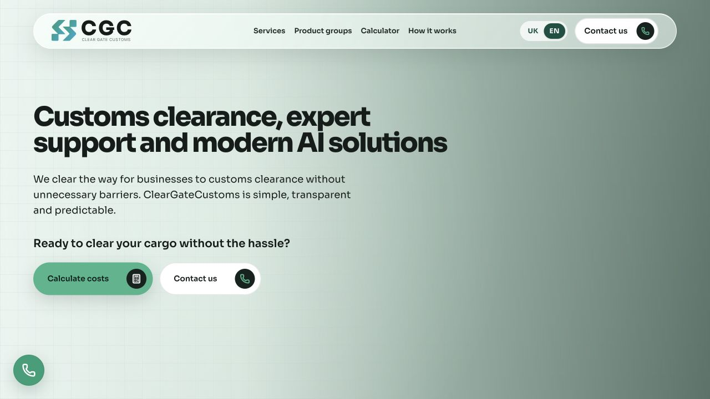
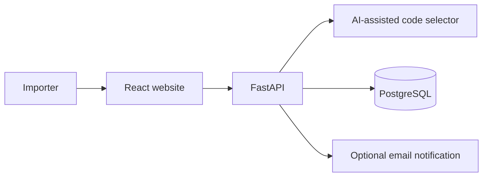

# ClearGate Customs

**A conversion-focused customs brokerage website that helps Ukrainian importers identify a likely UKT ZED code and send a structured clearance request.**

[Live Demo](https://portway-phi.vercel.app) · [API Docs](http://localhost:8000/docs) · [Source](https://github.com/eerinessofsilence/cleargatecustoms)



> **Status:** portfolio-ready MVP. The lead flow and database persistence are implemented; production use still requires legal review, monitoring, backups, and hardened deployment settings.

## What it delivers

- Turns an unstructured product description into suggested UKT ZED classifications.
- Captures qualified brokerage requests instead of losing them in generic contact forms.
- Stores every lead in PostgreSQL, with optional SMTP notifications for the team.
- Gives operators a typed FastAPI API and interactive Swagger documentation.
- Ships the frontend, API, migrations, and database as one Docker Compose stack.

## How it works



The AI result is guidance, not a binding customs ruling. A broker should verify the final classification.

## Quick start

```bash
git clone https://github.com/eerinessofsilence/cleargatecustoms.git
cd cleargatecustoms
docker compose up --build
```

Open `http://localhost:5173`. The website should load, while the API health and Swagger UI are available at `http://localhost:8000` and `http://localhost:8000/docs`.

For AI classification and email notifications, copy the backend environment template and add server-side credentials. Detailed local setup and configuration live in [`backend/.env.example`](backend/.env.example) and [`frontend/.env.example`](frontend/.env.example).

## Quality and security

```bash
cd frontend && npm run lint && npm run format:check && npm run build
cd ../backend && pytest
```

- Keep `OPENAI_API_KEY`, SMTP credentials, and database passwords out of Git.
- Restrict CORS, rotate secrets, enable TLS, and configure backups before deployment.
- Rate limiting, abuse protection, observability, and a formal security audit are not included yet.

## Project status and license

The repository is public for portfolio and evaluation purposes. No open-source license is currently included, so no permission for reuse is granted by default.
